# Coffee shop sales analysis 
In this analytical work I analyzed a coffee shop sales  to help the 
business make informed decisions aimed at increasing profitability. 
This  data provides valuable insights into customer purchasing behavior 
and operational patterns.

## Sales by day and hour
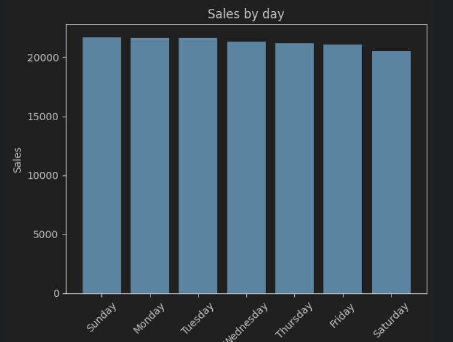
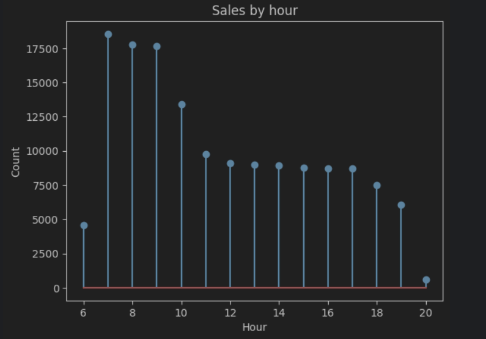
In these graphs we can see that sales don't really depend on weekday, 
but consumer activity tends to peak during morning hours, from 7:00 to 9:00 AM.

## Profit by type of product
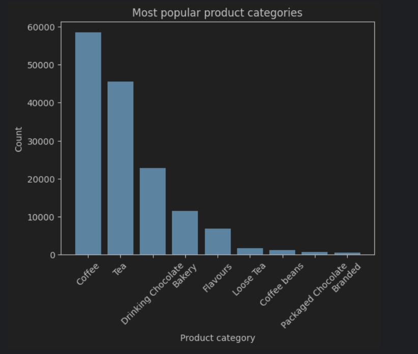
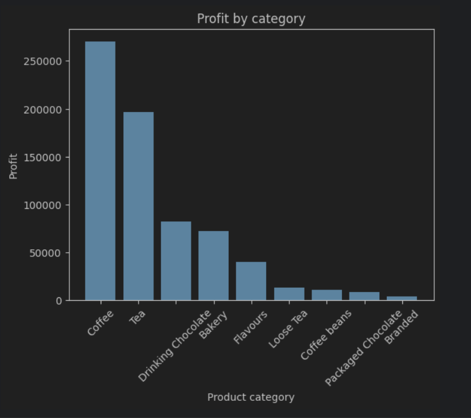

There we can see that coffee and tea products are the most popular and profitable,
but then popularity drastically decreases, so let's focus on first two categories

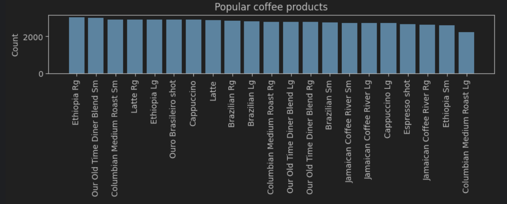
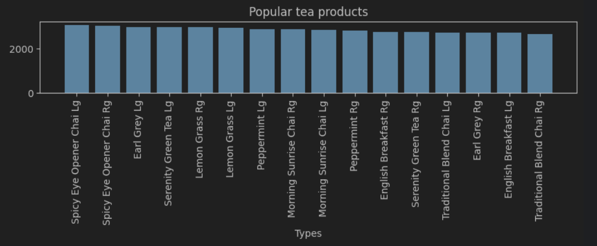

In these graphs we can see absence of difference in popularity between products.

## Profit by store location 
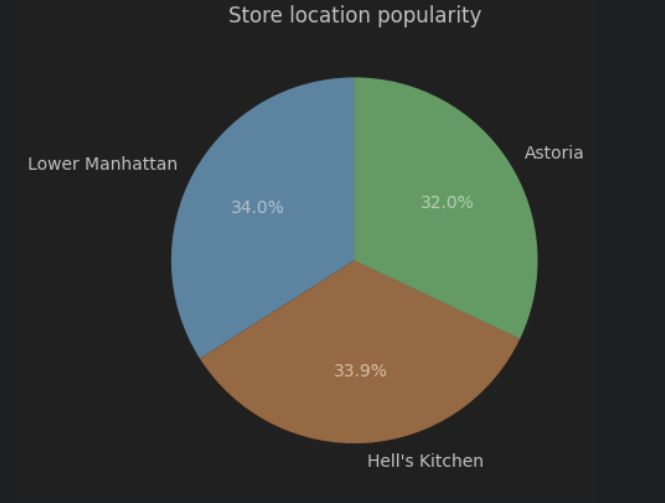
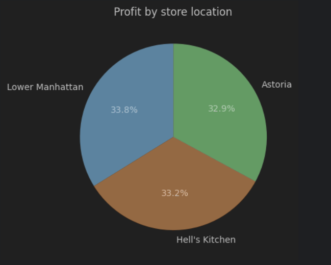

These pie charts show us that all 3 locations are popular, only Astoria is a bit less popular,
but despite this it makes a good profit

## Tableau
I created an interactive dashboard on Tableau, 
which shows what products are popular and more profitable in each location
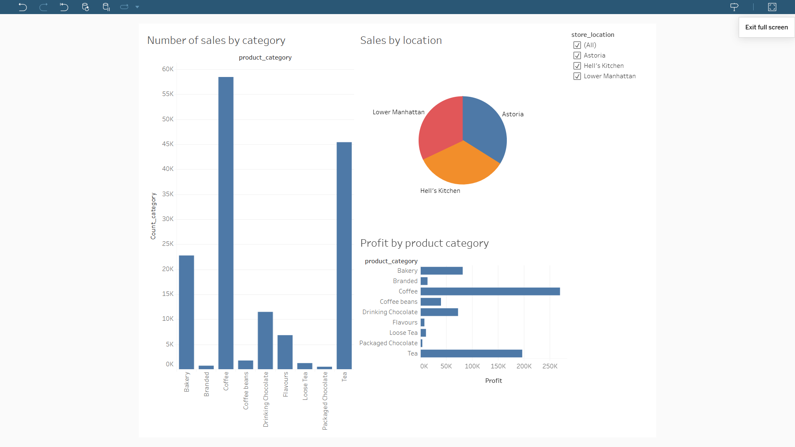
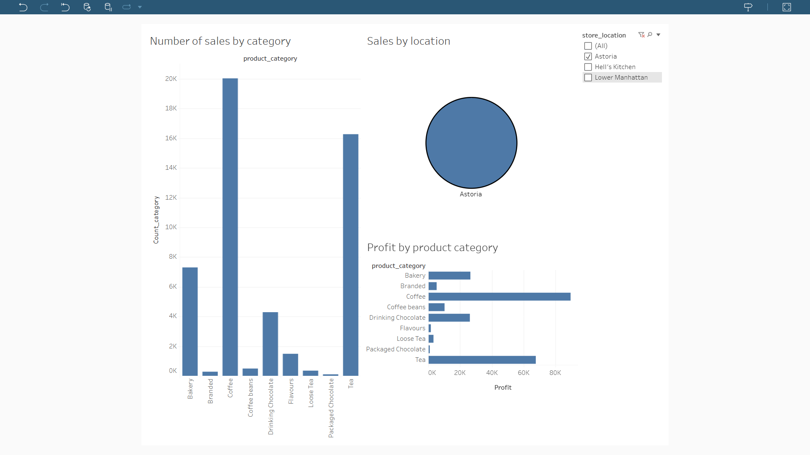
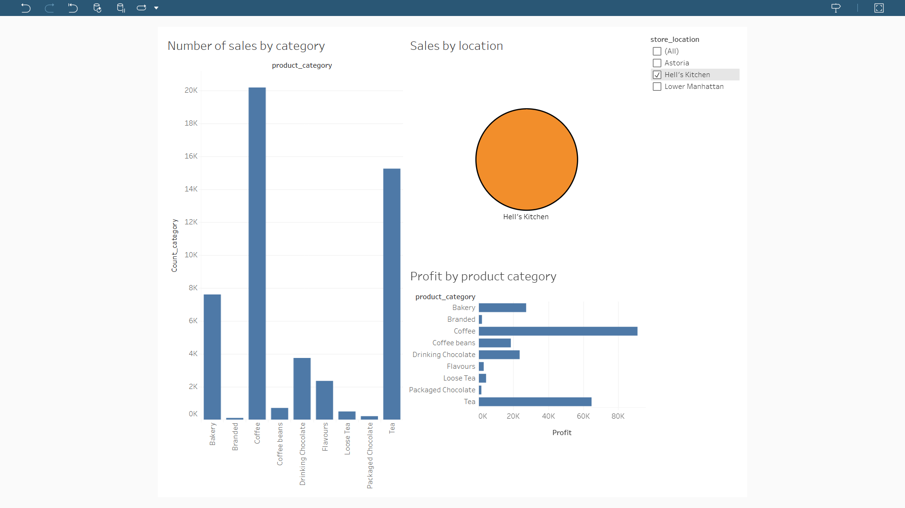
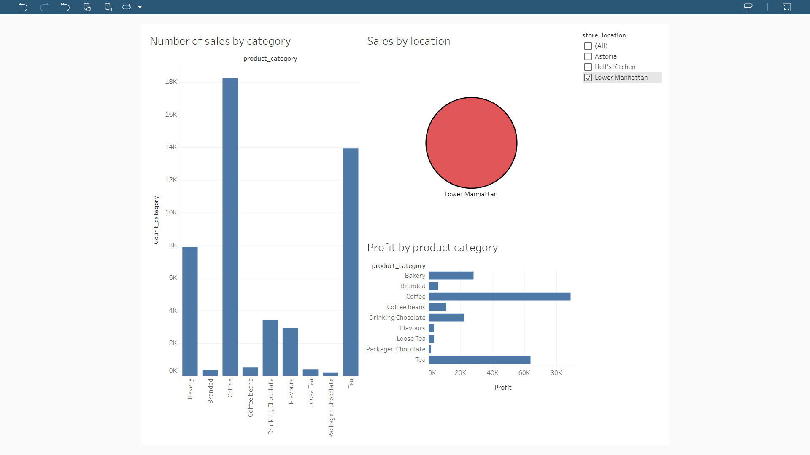